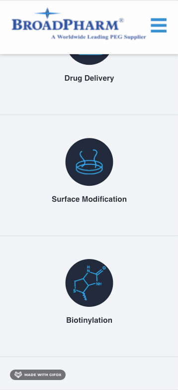
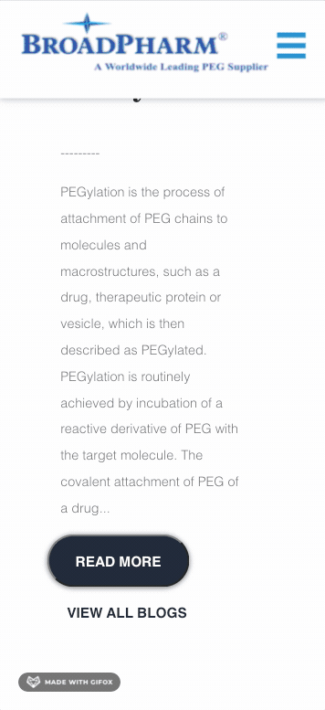
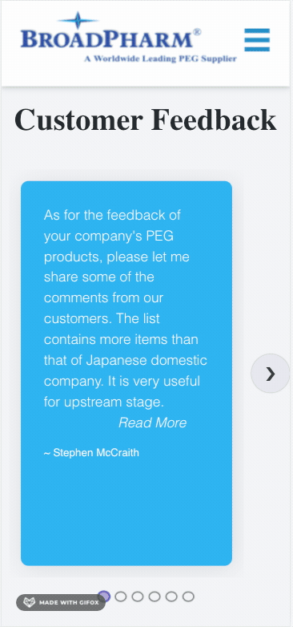
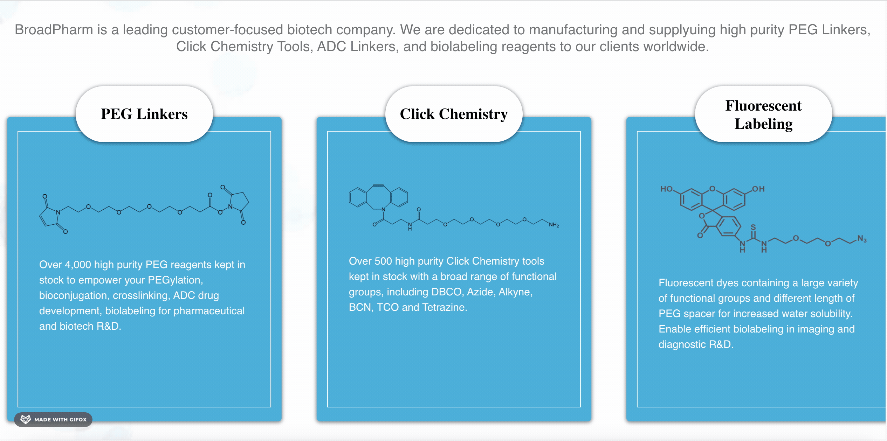
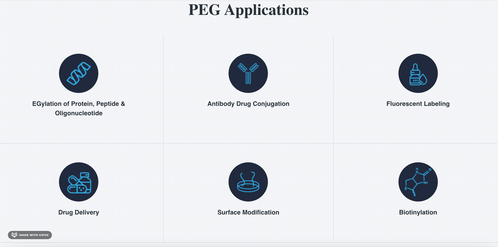

# Front-end Project

This project was built with React.

## Available Scripts

In the project directory, you can run:

### `npm install`

Set up development environment.

### `npm start`

Runs the app in the development mode.\
Open [http://localhost:3000](http://localhost:3000) to view it in the browser.

The page will reload if you make edits.\
You will also see any lint errors in the console.

### `npm run build`

Builds the app for production to the `build` folder.\
It correctly bundles React in production mode and optimizes the build for the best performance.

The build is minified and the filenames include the hashes.\
Your app is ready to be deployed!

## Demo [https://fir-front-end.web.app/](https://fir-front-end.web.app/)

### Mobile view

### Website view

